# QuikFix
---

### Deployed Site

[Deployed Website](https://e-commercemvc.azurewebsites.net/)

---
## Application Information

In a current society, businesses are required to have website and QuikFix is here to solve that problem. Our wonderful developers are here to create an intuitive website. Allowing us to not only be able to solve headache inducing problems inherent with creating a website, but also designing it to be scalable and game changing.

---
## Claims

- This website captures user's favorite color, the design a user wants and the type of business the employer owns. They are required to input this information during the registration page. Our goal is to utilize these claims to tailor each web page to the end user.

---

## Policies

- The website consists of user and admin. These roles help to differentiate between access to edit the product on the page. The admin will be given access to delete, update, create, and get a product that will be shown on the website. Additionally, the user will be prohibited from accessing the admin page, due to the policies in place.

---

## Tools Used
Microsoft Visual Studio Community 2019

- C#
- ASP.Net Core
- Entity Framework
- MVC
- xUnit
- Bootstrap
- Azure
- LazZiya.TagHelpers

---
## Vulnerability Report
[Vulnerability report](Vulnerability-report.md)

## ERD

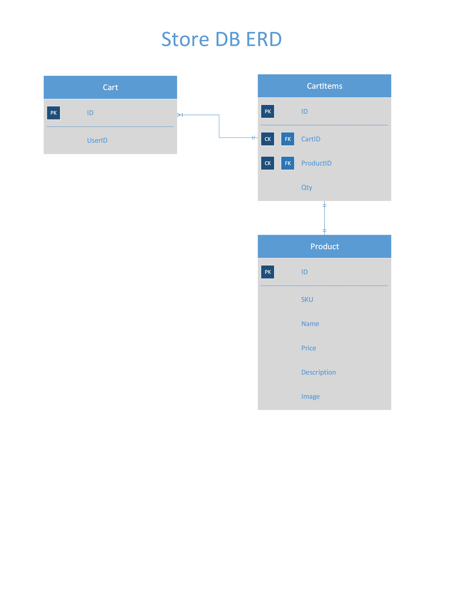

The ERD shown here is from Code Fellows 401 class for E-commerce project. As shown in the ERD, when the user signs up for our site, they will be given a unique primary key that will be stored in the `Cart` table, in conjunction to storing their information in the identity database. Once the user selects the website they like to purchase, it will add the productID and user's primary key to the `CartItems` table.this will also show the quantities they would like to purchase. Due to the quantity that is in this table, this table can be updated and deleted anytime the user purchases, deletes or updates their product. From this table, when the user enters their shopping cart, using the primary key of the product which is stored in the `CartItems`, each product will be rendered for that specific user.

---

## Visual

### Main Page
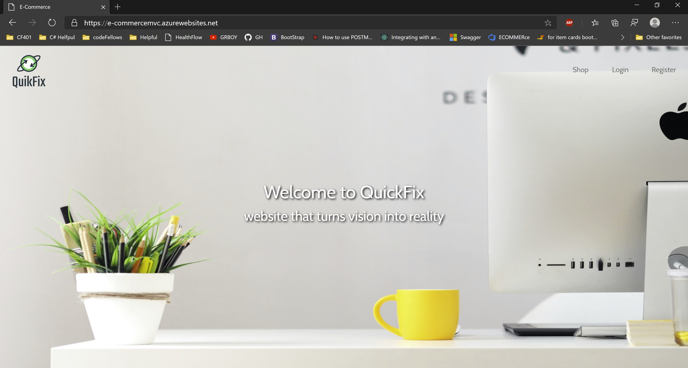

### Product Page
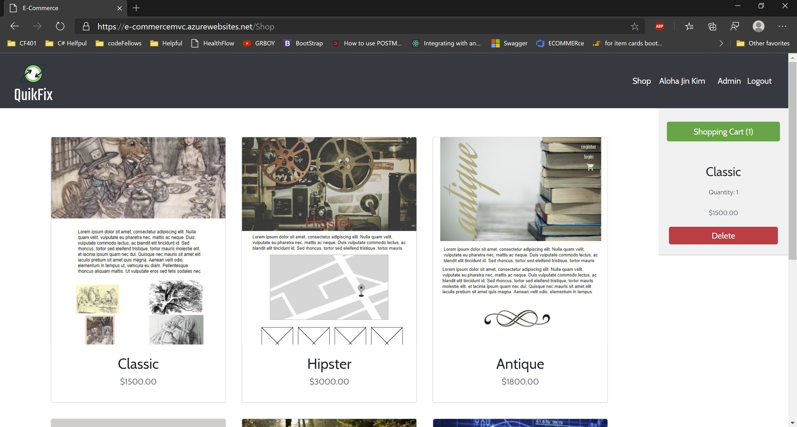

### Detail Page
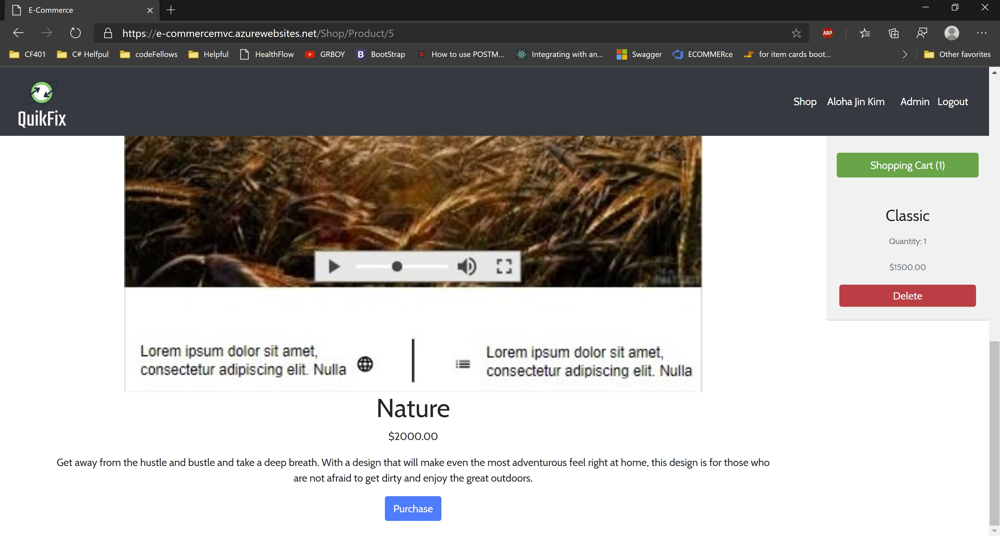

### Login Page
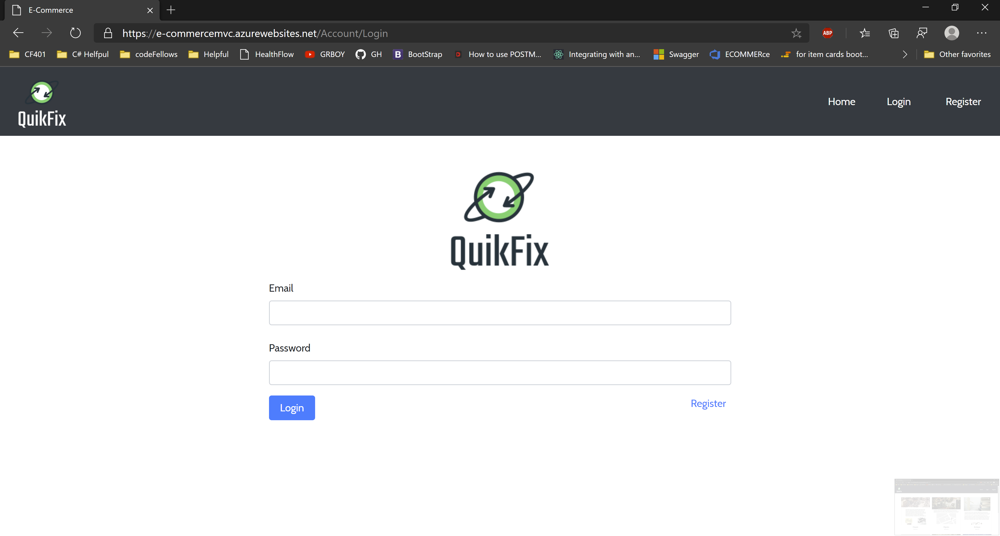

### Register Page
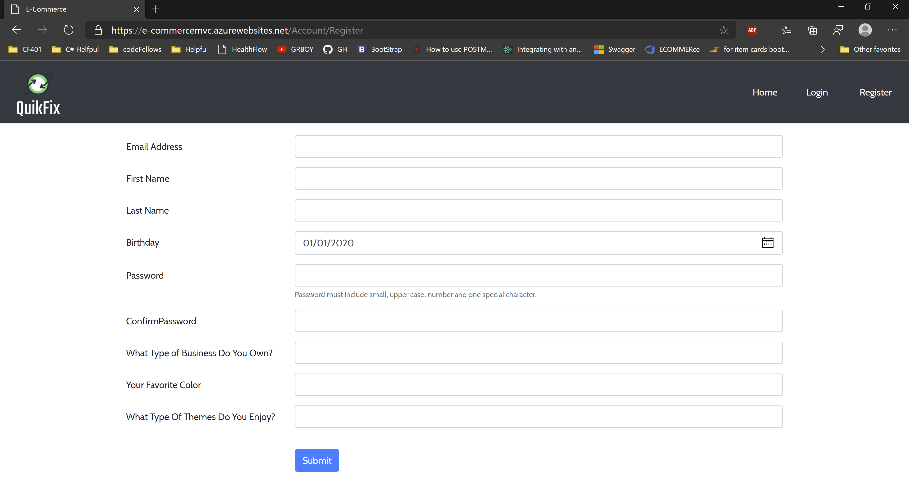

### Checkout Page
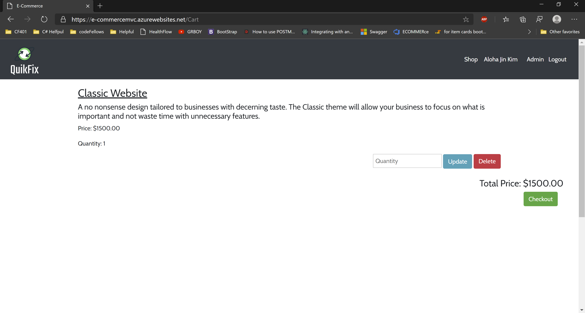

### Receipt Page
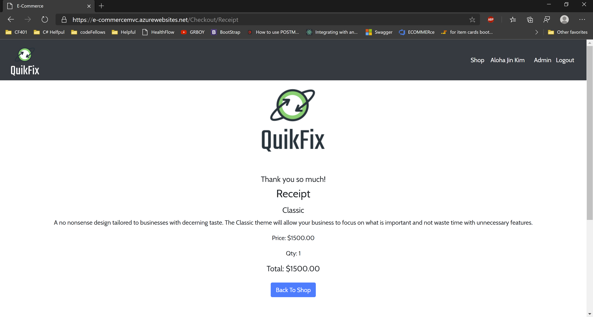

### Admin Dashboard
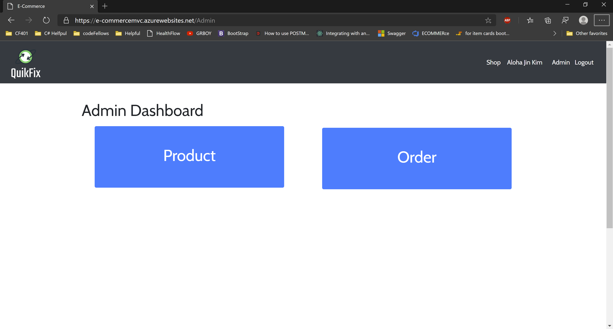

### Admin Product page

### Admin Product page
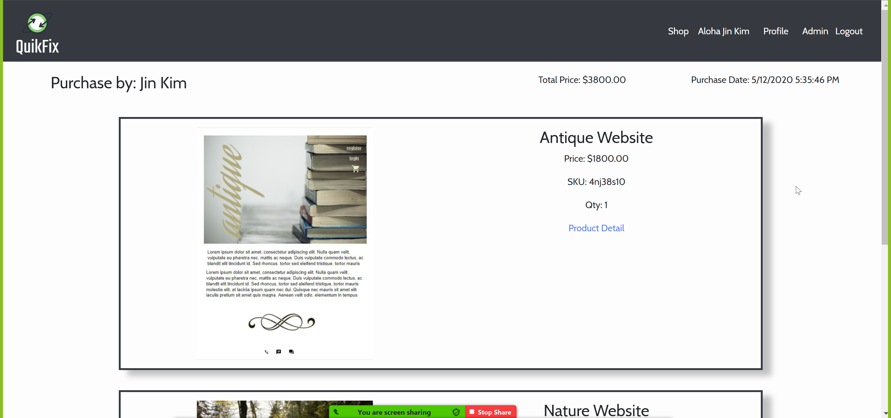

### Admin Profile page
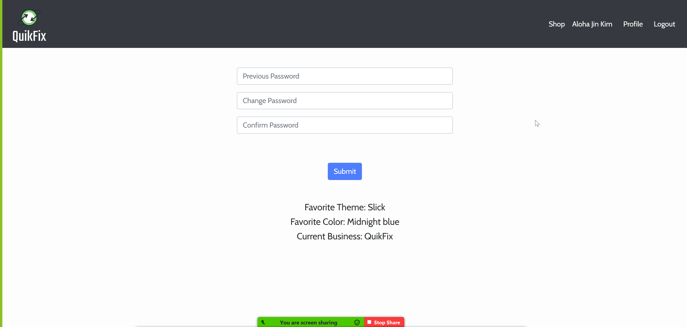

---

## Change Log

**2.0 Version Released**
- *Profile page was created and user is able to change their password, able to see their claims and past purchase history* 05 12,2020
- *Added order list that displays users order and able to navigate into specific product that they have purchased.* 05 11, 2020
- *Added receipt feature that will send receipt to user's email. Also, upon registration, user will receive confirmation email* 05 06, 2020
- *Added Admin Dashboard page to route them to product update page or order detail page* 05 01, 2020  
- *Added product detail page for Admin side* 04 30, 2020  

**1.0 Version Released**
- *User is able to receive an email when they sign-up and also when they purchase the items* 04 29, 2020
- *Checkout page is able to display items in the cart and added sidebar in the product/detail page* 04 28, 2020
- *README and styling for website is updated* 04 26, 2020
- *Added detail page to show description, price and title* 04 25, 2020
- *Created a shop and product page that will display all of our services and detail page* 04 24, 2020  
- *Added bootstrap to our website and having the login, register and logout functionality implemented* 04 22, 2020  
- *Added unit testing and second database for product* 04 21, 2020  
- *Created Hello World first Page* -  04 21, 2020

---

## Authors
[Harlen Lopez](https://github.com/harlenlopez)  
[Jin Kim](https://github.com/jinwoov)

---
## Credit
Photo by Georgie Cobbs on Unsplash  