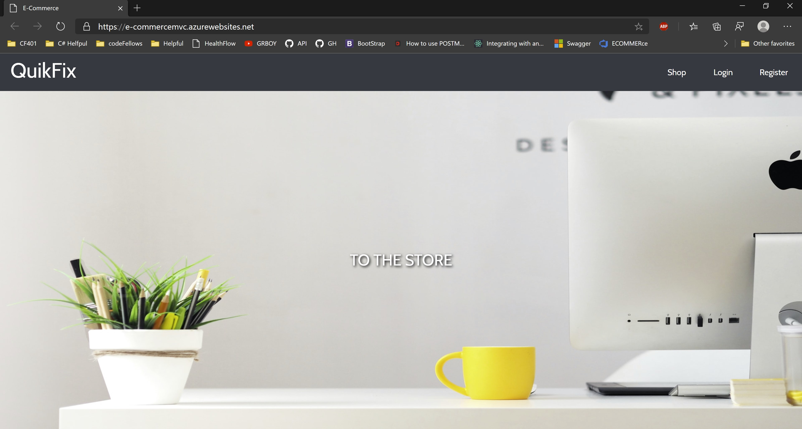
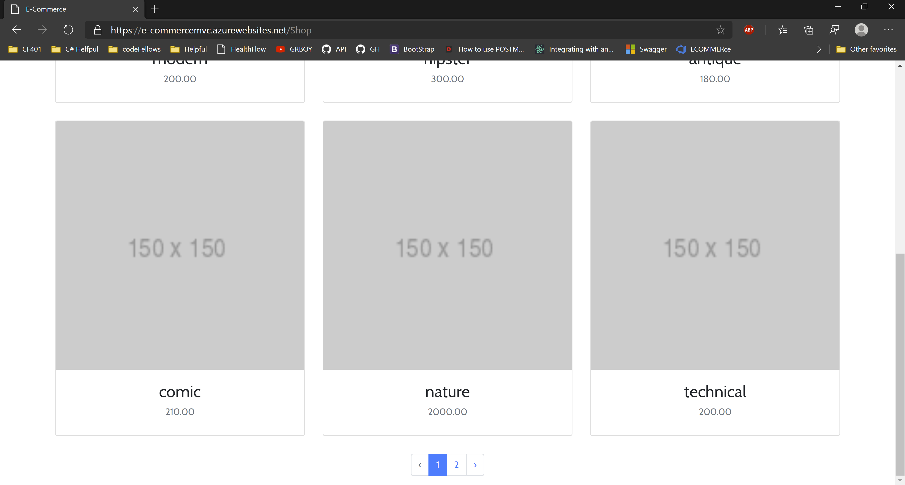
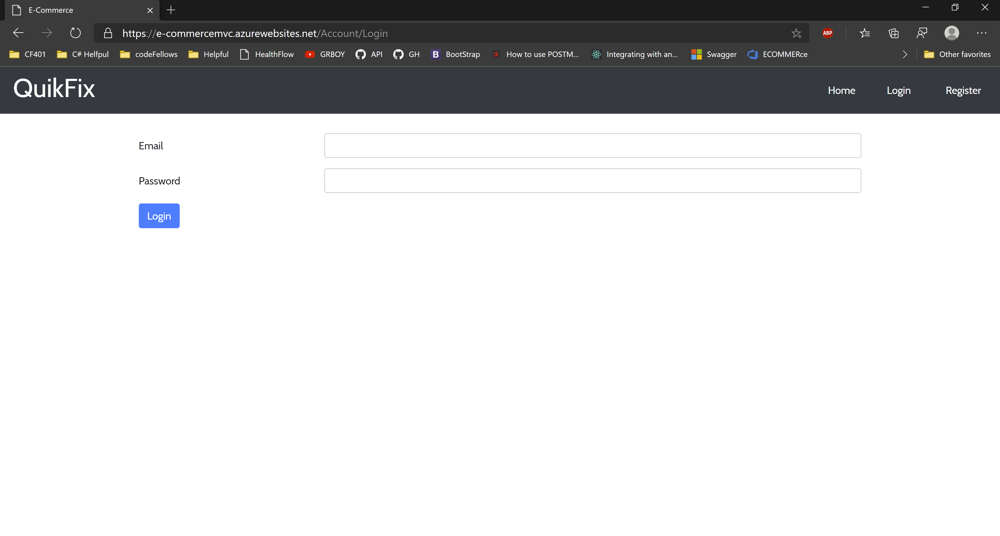
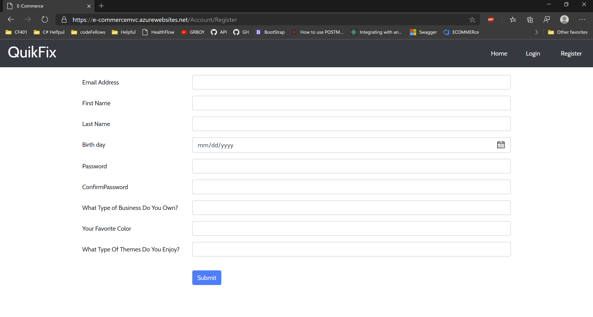

# QuikFix
---

### Deployed Site

[Deployed Website](https://e-commercemvc.azurewebsites.net/)

---
## Application Information

In a current society, businesses are required to have website and this QuikFix is here to solve that problem. Our wonderful developers are here to create a intuitive website that not only solve headaching problem of creating a website, but design it to be scalable and game changing.

---
## Claims

- This website captures favorite color, design that user wants and types of business that employer owns. 

---
## Tools Used
Microsoft Visual Studio Community 2019

- C#
- ASP.Net Core
- Entity Framework
- MVC
- xUnit
- Bootstrap
- Azure
- Swagger
- LazZiya.TagHelpers
---

## Visual

### Main Page

### Product Page

### Login Page

### Viewing Post Details

---
## Data Flow (Frontend, Backend, REST API)

---
## Data Model

### Overall Project Schema
***[Add a description of your DB schema. Explain the relationships to me.]***  

---

## Change Log
0.4: *Created a shop and product page that will display all of our services and detail page* 04 24, 2020  
0.3: *Added bootstrap to our website and having the login, register and logout functionality implemented* 04 22, 2020  
0.2: *Added unit tesing and second database for product* 04 21, 2020  
0.1: *Created Hello World first Page* -  04 21, 2020

---

## Authors
[Harlen Lopez](https://github.com/harlenlopez)  
[Jin Kim](https://github.com/jinwoov)

---
## Credit
Photo by Georgie Cobbs on Unsplash  