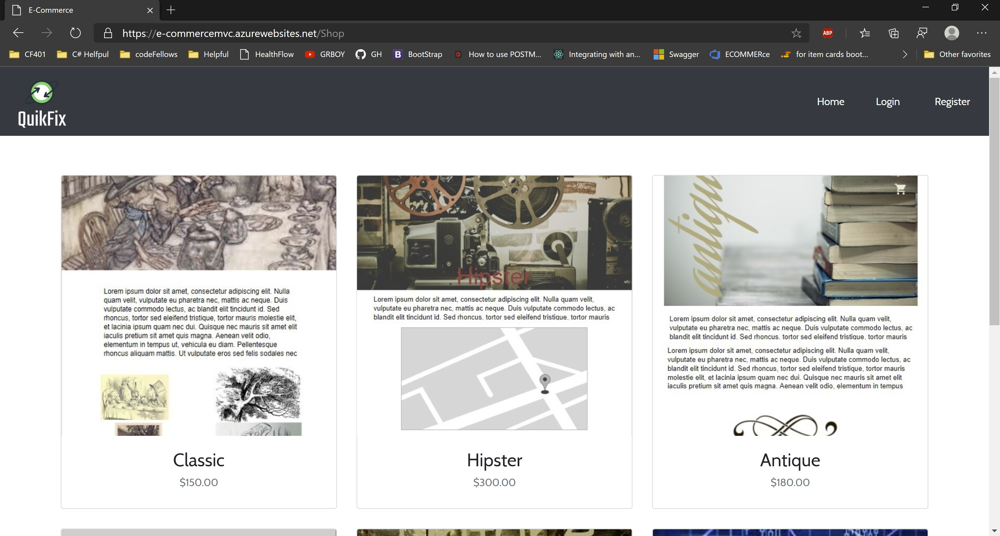
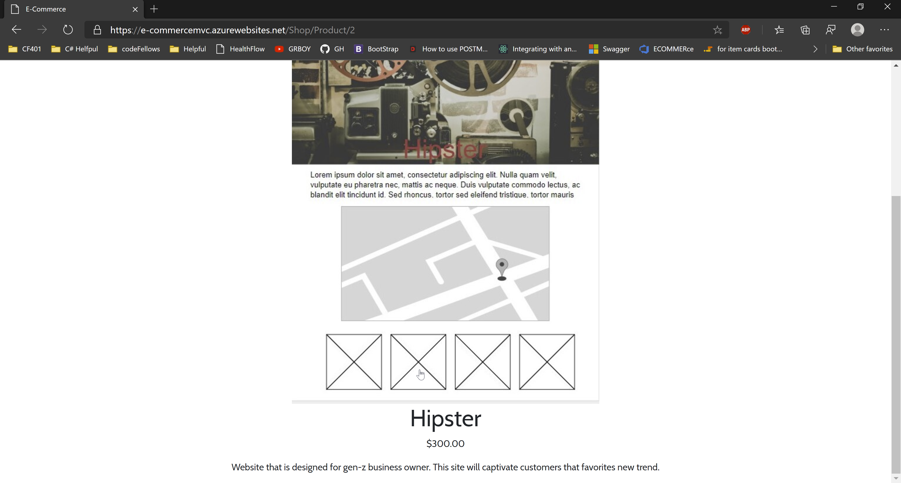

# QuikFix
---

### Deployed Site

[Deployed Website](https://e-commercemvc.azurewebsites.net/)

---
## Application Information

In a current society, businesses are required to have website and QuikFix is here to solve that problem. Our wonderful developers are here to create a intuitive website that not only solve headache inducing problem of creating a website, but design it to be scalable and game changing.

---
## Claims

- This website captures user's favorite color, design that user wants and the type of business the employer owns. They are required to input this information during the registration page. Our goal is to utilize these claims to tailor each web page to the end user.

---
## Tools Used
Microsoft Visual Studio Community 2019

- C#
- ASP.Net Core
- Entity Framework
- MVC
- xUnit
- Bootstrap
- Azure
- Swagger
- LazZiya.TagHelpers
---

## Visual

### Main Page

### Product Page

### Detail Page

### Login Page

### Viewing Post Details

---

## Change Log
0.6: *README and styling for website is updated* 04 26, 2020
0.5: *Added detail page to show description, price and title* 04 25, 2020
0.4: *Created a shop and product page that will display all of our services and detail page* 04 24, 2020  
0.3: *Added bootstrap to our website and having the login, register and logout functionality implemented* 04 22, 2020  
0.2: *Added unit tesing and second database for product* 04 21, 2020  
0.1: *Created Hello World first Page* -  04 21, 2020

---

## Authors
[Harlen Lopez](https://github.com/harlenlopez)  
[Jin Kim](https://github.com/jinwoov)

---
## Credit
Photo by Georgie Cobbs on Unsplash  