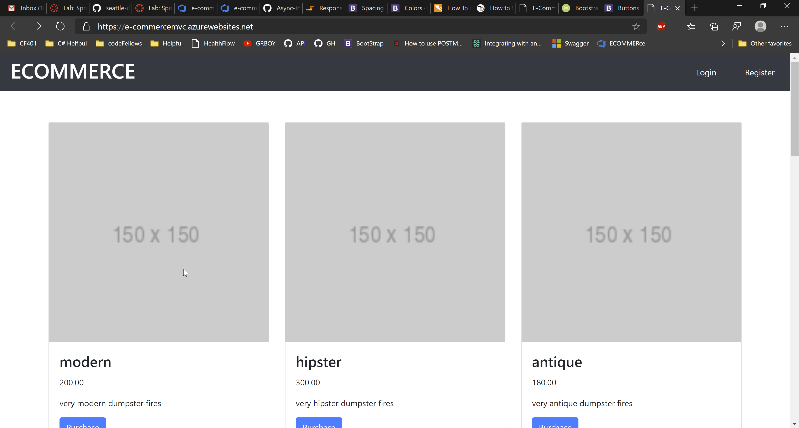

# Ecommerce-Project
---
### Deployed Site

[Deployed Site](https://e-commercemvc.azurewebsites.net/)

---
## Web Application

The web application consists of a frontend written in Razor views, HTML, CSS,
Bootstrap, Popper, and jQuery. The backend was written in C# using ASP.NET Core 2, Entity Framework Core, and the MVC framework.

---

## Tools Used
Microsoft Visual Studio Community 2019

- C#
- ASP.Net Core
- Entity Framework
- MVC
- xUnit
- Bootstrap
- Azure
- Swagger

---

## Usage

### Overview of Recent Posts

### Creating a Post

### Enriching a Post

### Viewing Post Details

---
## Data Flow (Frontend, Backend, REST API)

---
## Data Model

### Overall Project Schema
***[Add a description of your DB schema. Explain the relationships to me.]***  

---

## Change Log
0.3: *Added bootstrap to our website and having the login, register and logout functionality implemented* 04 22, 2020  
0.2: *Added unit tesing and second database for product* 04 21, 2020  
0.1: *Created Hello World first Page* -  04 21, 2020

---

## Authors
[Harlen Lopez](https://github.com/harlenlopez)  
[Jin Kim](https://github.com/jinwoov)

---

For more information on Markdown: https://www.markdownguide.org/cheat-sheet