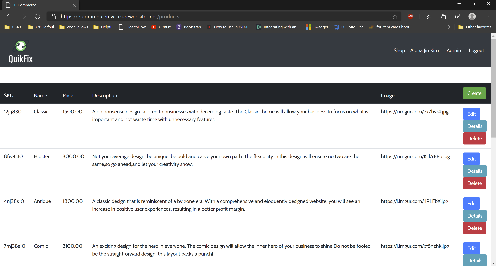

# QuikFix
---

### Deployed Site

[Deployed Website](https://e-commercemvc.azurewebsites.net/)

---
## Application Information

In a current society, businesses are required to have website and QuikFix is here to solve that problem. Our wonderful developers are here to create a intuitive website that not only solve headache inducing problem of creating a website, but design it to be scalable and game changing.

---
## Claims

- This website captures user's favorite color, design that user wants and the type of business the employer owns. They are required to input this information during the registration page. Our goal is to utilize these claims to tailor each web page to the end user.

---

## Policies

- The website consists of user and admin roles to differentiate the right that user has on editing the product on the website. Admin will be given an access to delete, update and create product that will be shown on website. On other hand, user will be prohibited from accessing that admin page due to the policies in place.

---

## Tools Used
Microsoft Visual Studio Community 2019

- C#
- ASP.Net Core
- Entity Framework
- MVC
- xUnit
- Bootstrap
- Azure
- LazZiya.TagHelpers
---
## ERD

The ERD shown here is from Code Fellows 401 class for E-commerce project. As shown in the ERD, when the user sign up to our site, they will be given unique primary key that will be stored in `Cart` table, in conjunction to storing their information in identity database. Once user selects website that they like to purchase, it will add productID and user's primary key to the `CartItems` table and also quantities that user wants to buy. Due to the quantity that is in this table, this table can be updated and deleted anytime user purchase, delete or update their product. From this table, when the user enters shoppping cart, using the primary key of the product that is stored in the `CartItems`, each product will be render for specific user.

---
## Visual

### Main Page

### Product Page

### Detail Page

### Login Page

### Register Page

### Checkout Page

### Receipt Page

### Admin Dashboard

### Admin Product page

---

## Change Log

1.2 *Added Admin Dashboard page to route them to product update page or order detail page* 05 01, 2020  
1.1 *Added product detail page for admin side* 04 30, 2020  

**1.0 Version Released**
- *User is able to receive a email when they signup and also when they purchase the items* 04 29, 2020
- *Checkout page is able to display items in the cart and added sidebar in the product/detail page* 04 28, 2020
- *README and styling for website is updated* 04 26, 2020
- *Added detail page to show description, price and title* 04 25, 2020
- *Created a shop and product page that will display all of our services and detail page* 04 24, 2020  
- *Added bootstrap to our website and having the login, register and logout functionality implemented* 04 22, 2020  
- *Added unit tesing and second database for product* 04 21, 2020  
- *Created Hello World first Page* -  04 21, 2020

---

## Authors
[Harlen Lopez](https://github.com/harlenlopez)  
[Jin Kim](https://github.com/jinwoov)

---
## Credit
Photo by Georgie Cobbs on Unsplash  